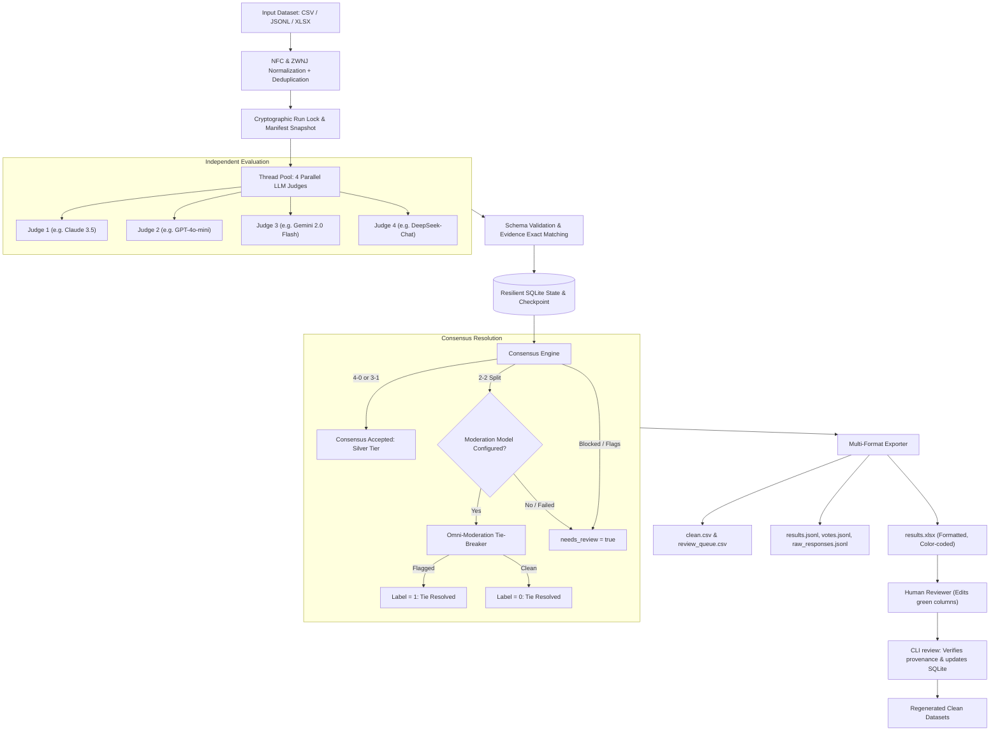

# Multi-Judge Offense Pipeline

[](https://www.python.org/downloads/)
[](https://opensource.org/licenses/MIT)
[]()
[]()

An industrial-grade, multi-judge LLM annotation pipeline for offensive speech, harassment, and toxicity detection in Persian and English. Employs 4 independent AI judges, automated moderation tie-breakers, strict schema verification, resilient SQLite checkpointing, and an interactive Human-in-the-Loop (HITL) Excel adjudication workflow.

---

## Architecture Overview



---

## Key Features

1. **Multi-Provider LLM Agnostic**:
   - Seamlessly connect to **OpenRouter**, **OpenAI**, **AvalAI**, **vLLM**, **Ollama**, or any standard OpenAI-compatible API.
   - Mix and match reasoning models (`chat` or `responses` route), strict JSON schema, and system prompts.
2. **Automated 2-to-2 Moderation Tie-Breaker**:
   - When 4 judges split evenly (2 vs 2), the system automatically queries an objective moderation endpoint (e.g., `omni-moderation-latest`) to break the tie, eliminating manual review overhead for common borderline cases.
3. **Advanced Network Routing (Pure Python - Zero Dependencies)**:
   - **`system`**: Standard operating system network routing (default for global endpoints like OpenRouter and OpenAI).
   - **`proxy`**: Built-in pure-Python SOCKS5 and HTTP proxy client (e.g., `socks5://127.0.0.1:10808` or `http://127.0.0.1:8080`). No external proxy libraries needed.
   - **`direct`**: Socket-level interface IP binding (`BIND_IP`) that directly bypasses local TUN/VPNs (sing-box, clash, v2ray) for domestic endpoints like AvalAI.
4. **Heuristic & Context Audit Guards**:
   - Detects and flags quotations, educational discourse, counter-speech, low self-reported confidence, and subtype disagreements (e.g., insult vs. harassment) even under unanimous 4/0 votes.
5. **Human-in-the-Loop (HITL) Excel Workflow**:
   - Generates beautifully styled, color-coded workbooks (`results.xlsx`) with formula injection protection.
   - Reviewers fill `human_label`, `reviewer`, and `review_note`.
   - The CLI imports human reviews with cryptographic tamper-proofing, updating records without overwriting model audit histories.
6. **Cultural Persian Nuances & Benchmark**:
   - Includes a culturally adapted 50-sample Persian benchmark (`examples/persian_offense_50.csv`) with full zero-width non-joiner (ZWNJ / نیم‌فاصله) normalization.

---

## Quick Start

### 1. Installation

Requires **Python 3.10+**.

```bash
git clone https://github.com/AmirAliRasoulii/multi-judge-offense-pipeline.git
cd multi-judge-offense-pipeline

python -m venv .venv
source .venv/bin/activate  # On Windows PowerShell: .venv\Scripts\Activate.ps1

pip install -r requirements.txt
cp .env.example .env
```

### 2. Provider Configuration

Edit `.env` to configure your API provider and 4 judge models:

#### Option A: OpenRouter (Global Models)
```dotenv
LLM_API_KEY=sk-or-v1-your-openrouter-key
LLM_BASE_URL=https://openrouter.ai/api/v1
NETWORK_MODE=system

MODEL_1=anthropic/claude-3.5-haiku
MODEL_2=openai/gpt-4o-mini
MODEL_3=google/gemini-2.0-flash-001
MODEL_4=deepseek/deepseek-chat
```

#### Option B: AvalAI (Iranian Domestic Gateway)
```dotenv
LLM_API_KEY=aa-your-avalai-key
LLM_BASE_URL=https://api.avalai.ir/v1
NETWORK_MODE=direct  # Automatically bypasses TUN/VPN so domestic requests do not drop

MODEL_1=gpt-4o-mini
MODEL_2=claude-haiku-4-5
MODEL_3=gemini-2.5-flash
MODEL_4=deepseek-chat
```

#### Option C: OpenAI Official API
```dotenv
LLM_API_KEY=sk-proj-your-openai-key
LLM_BASE_URL=https://api.openai.com/v1
NETWORK_MODE=system

MODEL_1=gpt-4o-mini
MODEL_2=gpt-4o
MODEL_3=o3-mini
MODEL_4=gpt-4.5-preview
```

#### Option D: Behind SOCKS5 Proxy (e.g. v2ray / clash)
```dotenv
LLM_API_KEY=your-api-key
LLM_BASE_URL=https://openrouter.ai/api/v1
NETWORK_MODE=proxy
PROXY_URL=socks5://127.0.0.1:10808
```

---

## CLI Usage

### Discover Available Models
```bash
python -m offense_judge models --env .env
```

### Dry Run (Estimate Calls & Validate Dataset)
```bash
python -m offense_judge dry-run --env .env --input examples/persian_offense_50.csv
```

### Run Full Annotation Pipeline
```bash
# Pilot test on first 10 records:
python -m offense_judge run --env .env --input examples/persian_offense_50.csv --limit 10 --output outputs/pilot

# Full run:
python -m offense_judge run --env .env --input examples/persian_offense_50.csv --output outputs/prod_run

# Safe resume & retry previously failed requests:
python -m offense_judge run --env .env --input examples/persian_offense_50.csv --output outputs/prod_run --retry-failed
```

### Export Existing Checkpoints (Without Network Calls)
```bash
python -m offense_judge export --run-dir outputs/prod_run
```

### Human Review Adjudication
1. Copy `outputs/prod_run/results.xlsx` to `outputs/prod_run/reviewed.xlsx`.
2. Open the file in Excel or LibreOffice Calc. Fill in the green columns: `human_label` (0 or 1), `reviewer`, and `review_note`.
3. Ingest your human adjudication back into the pipeline:
```bash
python -m offense_judge review --run-dir outputs/prod_run --workbook outputs/prod_run/reviewed.xlsx
```

### Offline Demo
Run a complete, zero-network self-test with built-in test fixtures:
```bash
python -m offense_judge demo --output outputs/demo
```

---

## Output Files Breakdown

Every execution generates a structured, auditable directory:

| File | Format | Description |
|---|---|---|
| `results.xlsx` | Excel Workbook | Formatted overview (`Results` tab with conditional formatting, `Votes` tab with raw judge breakdowns, `Summary` tab). |
| `clean.csv` | CSV | High-confidence dataset containing only records with resolved labels (`final_label` = 0 or 1). |
| `review_queue.csv` | CSV | Borderline items flagged for human adjudication (`needs_review = true`). |
| `results.jsonl` | JSONL | Comprehensive per-record data, model justifications, category tags, and provenance. |
| `votes.jsonl` | JSONL | Granular individual votes (4 votes per record) with token timestamps and self-reported probabilities. |
| `raw_responses.jsonl` | JSONL | Full raw API payloads, latency records, retry counts, and system responses. |
| `state.sqlite` | SQLite DB | Resilient ACID transaction log for instant interruption and resumption. |
| `manifest.json` | JSON | Cryptographic run ledger with sanitized configs, prompt snapshot, schema version, and input hash. |
| `summary.json` | JSON | Macro execution statistics: token usage, consensus rate, flag distributions, and error totals. |

---

## Consensus Matrix & Labeling Rules

| Positive / Negative Votes | Candidate Label | Default System Behavior |
|:---:|:---:|---|
| **4 / 0** | **1** | Accepted as Silver tier (unless blocking flags like quotation or educational context exist). |
| **3 / 1** | **1** | Majority consensus accepted with a minority dissent audit flag. |
| **2 / 2** | **Tie** | Evaluated by `MODERATION_MODEL` (`omni-moderation-latest`). If flagged &rarr; `1`, else &rarr; `0`. If moderation is absent/fails &rarr; flagged for human review. |
| **1 / 3** | **0** | Majority consensus non-offensive with a minority dissent audit flag. |
| **0 / 4** | **0** | Unanimous non-offensive consensus accepted. |
| **Malformed / Refusal** | **null** | Strict retry attempted; if unresolved &rarr; flagged red as `review_required`. |

---

# راهنمای فارسی (Persian Documentation)

### مقدمه و هدف پایپ‌لاین
تشخیص توهین، نفرت‌پراکنی و شوخی‌های زننده در زبان فارسی به‌دلیل وجود کنایه‌ها، طعنه، نقل‌قول‌ها و ساختارهای غیررسمی، با مدل‌های تک‌گانه همواره خطای بالایی دارد. این سیستم با الهام از اصول **LLM-as-a-Judge** و ساختار هیئت داوران مستقل، از **چهار مدل هوش مصنوعی مختلف** به‌طور هم‌زمان برای داوری متن استفاده می‌کند.

### مزایای کلیدی:
1. **استقلال کامل از ارائه‌دهنده (Provider-Agnostic):**
   - امکان کار با **OpenRouter** (دسترسی به کلود، لاما، جمینای و دیپ‌سیک).
   - امکان کار با **AvalAI** (پرووایدر بومی با مسیریابی مستقیم).
   - امکان اتصال به **مدل‌های محلی (Local vLLM / Ollama)** از طریق پروتکل سازگار با OpenAI.
2. **حل خودکار تساوی ۲ به ۲ (Tie-Breaker):**
   - در صورت دو به دو شدن آرای داوران، مدل Omni-Moderation به‌صورت خودکار متن را بازبینی کرده و گره تساوی را باز می‌کند.
3. **مدیریت شبکه و پروکسی بدون نیاز به کتابخانه‌های اضافی:**
   - حالت `direct`: اتصال مستقیم به اینترفیس فیزیکی سیستم جهت عبور از VPN/TUN داخلی برای سایت‌های ایرانی.
   - حالت `proxy`: پشتیبانی داخلی از SOCKS5 و HTTP Proxy برای عبور از فیلترینگ هنگام اتصال به OpenRouter/OpenAI.
   - حالت `system`: استفاده از شبکه پیش‌فرض سیستم‌عامل.
4. **فرایند بازبینی انسانی (Human-in-the-Loop):**
   - خروجی اکسل با رنگ‌بندی تفکیک‌شده که داور انسانی تنها ستون‌های مشخص را پر می‌کند و با دستور `review` داده‌ها اعتبارسنجی شده و مجدداً ثبت می‌شوند.

### اجرای تست‌های خودکار
برای اطمینان از سلامت کامل تمام اجزا و پایپ‌لاین:
```bash
python -m unittest discover -s tests -v
```

---

## License

This project is licensed under the [MIT License](LICENSE).
